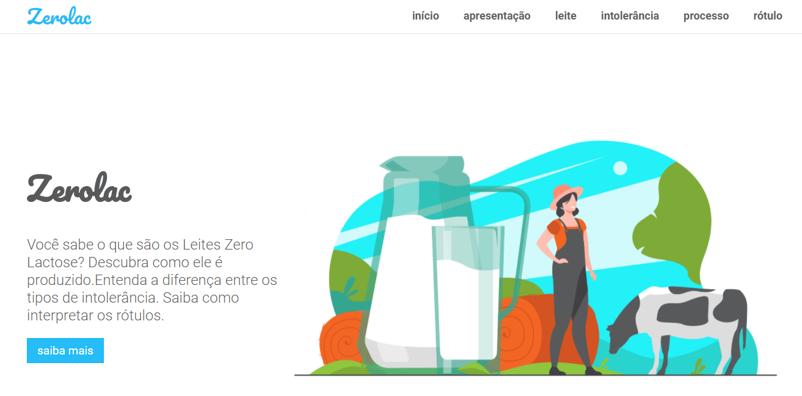

<h1 align="center">
  :cow:
   
   
  Zerolac
</h1>

<h3 align="center">
<strong>Information about milk.</strong>
</h3>

  
  
  
  
   
   
  <a href="#space_invader-technologies">Technologies</a>
  |
  <a href="#information_source-how-to-use">How to use</a>
   
   
  
   
   
   
   
   

## :space_invader: Technologies

- HTML
- Typescript
- CSS
- [Next.js](https://nextjs.org/)
- [React](https://pt-br.reactjs.org/)
- [React Icons](https://react-icons.github.io/react-icons/)
- [React scrollspy](https://github.com/makotot/react-scrollspy)
- [Axios](https://github.com/axios/axios)
- [Styled-compents](https://styled-components.com/)
- [Netlify](https://www.netlify.com/)
- [Strapi](https://strapi.io/)
